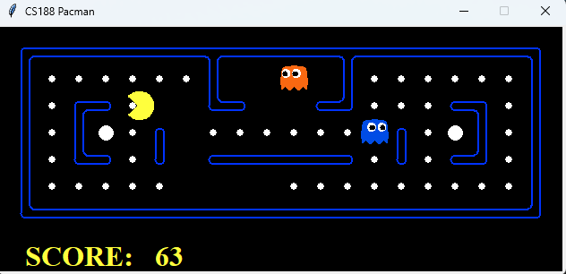

# Pacman Multiagent AI
Implemented intelligent Pacman agents using adversarial search and improved evaluation heuristics.

## Table of Contents
- [About](#about)
- [Screenshot](#screenshot)
- [Features](#features)
- [Tech Stack](#tech-stack)
- [Getting Started](#getting-started)
  - [Prerequisites](#prerequisites)
  - [Installation](#installation)
- [Usage / Examples](#usage--examples)
  - [Examples](#examples)

## About
Implementation of intelligent Pacman agents with minimax, 
alpha-beta pruning, expectimax, and an improved evaluation 
function using the UC Berkeley Pacman framework.

## Screenshot
<p align="center">
  
</p>
<p align="center">
  <em>Pacman game running with custom AI agent</em>
</p>

## Features
- **Reflex Agent**
  - Chooses actions based on a custom evaluation function. 
  - Balances distance to food, capsules, and ghost proximity.

- **Minimax Agent**
  - Implements adversarial search where ghosts act as opponents.
  - Searches to a configurable depth.

- **Alpha-Beta Agent**
  - Optimized minimax with alpha–beta pruning.
  - Reduces computation while maintaining optimal play.

- **Expectimax Agent**
  - Models ghosts as stochastic agents (not strictly adversarial).
  - Plans under uncertainty by averaging over ghost moves.

- **Better Evaluation Function**
  - Advanced heuristic that considers:
    - Distance to nearest food and capsules
    - Ghost proximity (scared ghosts vs. active ghosts)
    - Remaining capsules and food
    - Potential reward for eating scared ghosts
  - Provides stronger performance than the default score function.

## Tech Stack
<p align="center">
  
  
  
</p>

## Getting Started

### Prerequisites
Make sure you have the following installed on your system:

- **Python 3.8+** [Download here](https://www.python.org/downloads/release/python-380/)

### Installation
- Clone the project: ```git clone https://github.com/souhaibelh/Pacman-Agents```
- Open the project's root folder: ```cd Pacman-Agents```
- Create pacman_multiagent folder: ```mkdir pacman_multiagent```
- Copy all files to that folder: ```https://github.com/souhaibelh/Pacman-Agents```
- Enter the folder: ```cd pacman_multiagent```

### Usage / Examples
- **Command:**
```python pacman.py -p [agent] -g [ghost_behavior] -l [layout] -a depth=[depth] -n [number_of_games] [-q]```
- Replace **[agent]** for the type of agent pacman will use, find them in the **multiAgents.py** file.
- Replace **[ghost_behavior]** for the type of behavior the ghosts will use, find them in the **ghostAgents.py** file.
- Replace **[layout]** for the type of map the game will happen, find them inside the **./layouts** folder.
- Replace **[depth]** for the search depth, only used for search-based agents like **MinimaxAgent** and **AlphaBetaAgent**.
- Replace **[number_of_games]** for the amount of games to run.
- Include the **[-q]** flag if we want to skip the graphical interface and have the results sooner.

#### Examples
- ```python pacman.py -p ReflexAgent -g RandomGhost -l smallClassic```
- ```python pacman.py -p MinimaxAgent -g DirectionalGhost -l mediumClassic -a depth=3```
- ```python pacman.py -p AlphaBetaAgent -g RandomGhost -l smallClassic -a depth=4 -n 10 -q```
